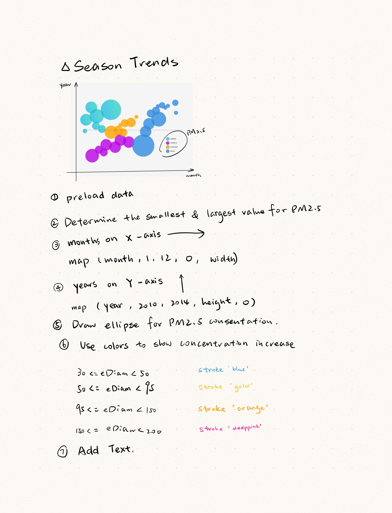

**1. What dataset did you use?**  

Beijing Air Quality  

**2. Why did you choose this dataset?**  

As a designer focus on sustainability, I’d like to create a data visualization related to environmental concerns to promotes awareness about ecological issues.  

**3. Which fields/features/parameters of the dataset did you use?**  

Year, Month, PM2.5  

**4. How many data points did you use?**  

All  

**5. What are you visualizing? How do the shapes, colors or movement relate to the data values?**  

Season trends: Investigate the dataset for seasonal trends by aggregating data over months in 5 years and visualizing how PM2.5 levels change throughout the year.  

The circle size represents the PM2.5 concentration, with color transitioning from blue to yellow, orange, and finally deep pink as the concentration increases to its highest level.  

Thinking Process:  

